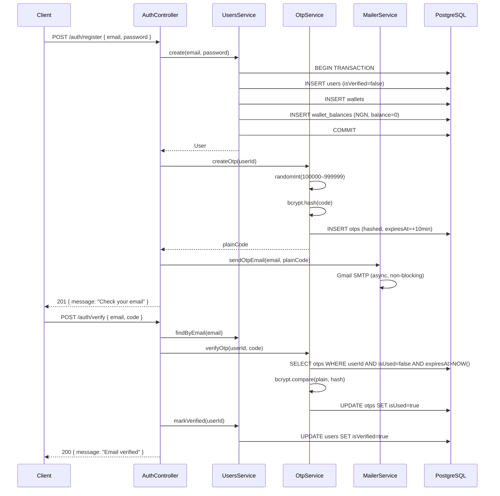
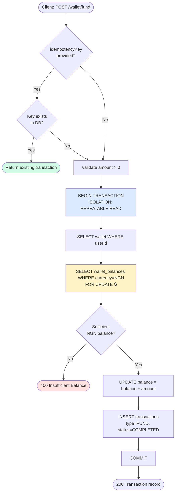
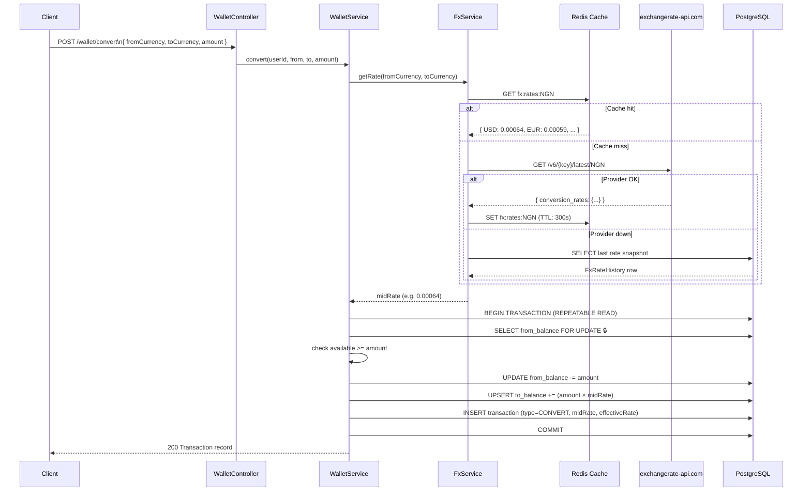
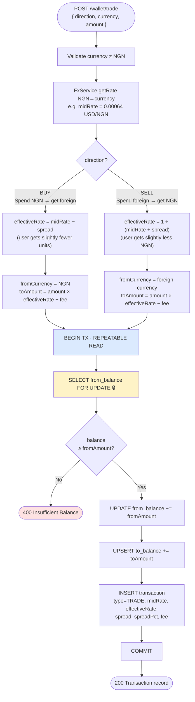
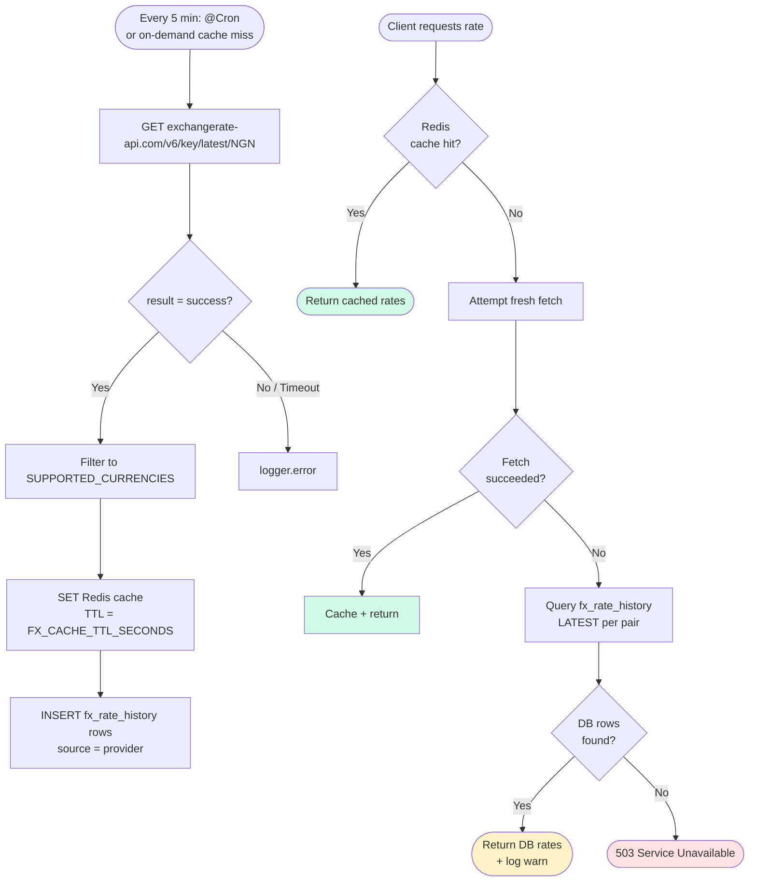

# FX Trading App

A production-ready NestJS backend for an FX Trading platform. Users can register, verify their email via OTP, fund a multi-currency wallet, and convert or trade currencies using real-time exchange rates.

---

## Table of Contents

- [Setup Instructions](#setup-instructions)
- [Environment Variables](#environment-variables)
- [API Documentation](#api-documentation)
- [Key Assumptions](#key-assumptions)
- [Architectural Decisions](#architectural-decisions)
- [Flow Diagrams](#flow-diagrams)

---

## Setup Instructions

### Prerequisites

- Node.js ≥ 20
- Docker & Docker Compose (for Postgres + Redis)
- A free [exchangerate-api.com](https://www.exchangerate-api.com) API key
- A Gmail account with an [App Password](https://myaccount.google.com/apppasswords) enabled

### 1. Clone and install

```bash
git clone <your-repo-url>
cd fx-trading-app
npm install
```

### 2. Configure environment

```bash
cp .env.example .env
# Fill in JWT_SECRET, FX_API_KEY, GMAIL_USER, GMAIL_APP_PASSWORD
```

### 3. Start infrastructure

```bash
docker-compose up -d
# Starts PostgreSQL (port 5432) and Redis (port 6379)
```

### 4. Run the application

```bash
# Development (watch mode)
npm run start:dev

# Production
npm run build && npm run start:prod
```

### 5. Seed the admin user

```bash
npm run seed:admin
# Default admin: admin@fxtrading.dev / Admin@12345!
# Override via SEED_ADMIN_EMAIL and SEED_ADMIN_PASSWORD in .env
```

### 6. View API docs

Open [http://localhost:3000/api/docs](http://localhost:3000/api/docs) in your browser (now commit the files with the rigjt UI).

---

## Environment Variables

| Variable | Default | Description |
|---|---|---|
| `PORT` | `3000` | HTTP server port |
| `NODE_ENV` | `development` | Environment (`development` / `production` / `test`) |
| `DB_HOST` | — | PostgreSQL host |
| `DB_PORT` | `5432` | PostgreSQL port |
| `DB_USERNAME` | — | PostgreSQL user |
| `DB_PASSWORD` | — | PostgreSQL password |
| `DB_NAME` | — | PostgreSQL database name |
| `JWT_SECRET` | — | JWT signing secret (min 32 chars) |
| `JWT_EXPIRES_IN` | `15m` | JWT token lifetime |
| `GMAIL_USER` | — | Gmail address for sending OTP emails |
| `GMAIL_APP_PASSWORD` | — | Gmail App Password |
| `FX_API_KEY` | — | exchangerate-api.com API key |
| `FX_API_BASE_URL` | `https://v6.exchangerate-api.com/v6` | FX provider base URL |
| `FX_CACHE_TTL_SECONDS` | `300` | How long to cache FX rates in Redis (seconds) |
| `SUPPORTED_CURRENCIES` | `USD,EUR,GBP,CAD,JPY` | Comma-separated foreign currencies |
| `TRADE_SPREAD_PERCENT` | `0.005` | Spread applied on trade orders (0.5%) |
| `TRADE_FEE_FLAT` | `0` | Flat fee per trade (0 = free) |
| `REDIS_HOST` | `localhost` | Redis host |
| `REDIS_PORT` | `6379` | Redis port |
| `THROTTLE_TTL_SHORT` | `1000` | Short throttle window (ms) |
| `THROTTLE_LIMIT_SHORT` | `5` | Max requests per short window |
| `THROTTLE_TTL_MEDIUM` | `60000` | Medium throttle window (ms) |
| `THROTTLE_LIMIT_MEDIUM` | `100` | Max requests per medium window |
| `SEED_ADMIN_EMAIL` | `admin@fxtrading.dev` | Admin email for seed script |
| `SEED_ADMIN_PASSWORD` | `Admin@12345!` | Admin password for seed script |

---

## API Documentation

Full interactive docs are available at **`/api/docs`** (Swagger UI) when the app is running.

### Auth

| Method | Endpoint | Auth | Description |
|---|---|---|---|
| `POST` | `/api/v1/auth/register` | Public | Register with email + password, triggers OTP email |
| `POST` | `/api/v1/auth/verify` | Public | Verify email with 6-digit OTP |
| `POST` | `/api/v1/auth/login` | Public | Login, returns JWT access token |
| `POST` | `/api/v1/auth/resend-otp` | Public | Resend OTP (max 3 per 10 min) |

### Wallet

| Method | Endpoint | Auth | Description |
|---|---|---|---|
| `GET` | `/api/v1/wallet` | JWT | Get all currency balances |
| `POST` | `/api/v1/wallet/fund` | JWT | Fund wallet in NGN |
| `POST` | `/api/v1/wallet/convert` | JWT | Convert between currencies at mid-market rate |
| `POST` | `/api/v1/wallet/trade` | JWT | Trade NGN ↔ foreign currency (spread applied) |

### FX Rates

| Method | Endpoint | Auth | Description |
|---|---|---|---|
| `GET` | `/api/v1/fx/rates` | Public | Get live FX rates (base: NGN) |

### Transactions

| Method | Endpoint | Auth | Description |
|---|---|---|---|
| `GET` | `/api/v1/transactions` | JWT | Paginated transaction history with filters |

### Admin

| Method | Endpoint | Auth | Description |
|---|---|---|---|
| `GET` | `/api/v1/admin/users` | JWT + ADMIN | List all users |
| `PATCH` | `/api/v1/admin/users/:id/status` | JWT + ADMIN | Activate / deactivate a user |
| `POST` | `/api/v1/admin/fx/rate-override` | JWT + ADMIN | Insert a manual FX rate override |
| `GET` | `/api/v1/admin/transactions` | JWT + ADMIN | View all transactions (paginated) |

### Analytics

| Method | Endpoint | Auth | Description |
|---|---|---|---|
| `GET` | `/api/v1/analytics/trades` | JWT | Aggregated trade volume by currency pair + day |
| `GET` | `/api/v1/analytics/fx-trends` | JWT | Historical FX rate data for a pair |

---

## Key Assumptions

1. **NGN-only funding** — `POST /wallet/fund` accepts NGN only. Multi-currency funding is architecturally supported by removing the currency check in `WalletService.fund`.
2. **Initial wallet balance is 0** — Wallets are created at registration with a 0 NGN balance. Users must fund before trading.
3. **Convert vs Trade distinction** — `/wallet/convert` uses the mid-market rate with zero spread (peer-to-peer style). `/wallet/trade` applies a configurable spread (default 0.5%) modelling a market order with a bid/ask spread.
4. **FX rates are NGN-based** — All rates are fetched as NGN → foreign currency. Cross-currency rates (e.g. USD → EUR) are computed as `rate[toCurrency] / rate[fromCurrency]`.
5. **Rate fallback chain** — On provider failure: (1) serve Redis cache, (2) fetch fresh from provider, (3) serve last DB snapshot, (4) throw `503 Service Unavailable`.
6. **No double-spend** — All wallet mutations use PostgreSQL `REPEATABLE READ` transactions with `SELECT ... FOR UPDATE` (pessimistic write lock) on the affected `wallet_balances` rows.
7. **Idempotency** — All mutating wallet operations accept an optional `idempotencyKey` (UUID). If a key is re-submitted, the original transaction is returned without re-executing.
8. **OTP security** — OTPs are 6-digit, cryptographically random, bcrypt-hashed at rest, expire in 10 minutes, and are invalidated on resend.
9. **Unverified users cannot trade** — Login is rejected for unverified accounts. The `JwtAuthGuard` is global; only `@Public()` routes bypass it.
10. **Currency auto-creation** — When a user receives a currency they've never held (e.g., first USD from a trade), a new `wallet_balances` row is created atomically within the same transaction.

---

## Architectural Decisions

### Module Structure

Each domain is a fully isolated NestJS module (`UsersModule`, `AuthModule`, `WalletModule`, `FxModule`, `TransactionsModule`, `OtpModule`, `MailerModule`, `AdminModule`, `AnalyticsModule`). Modules expose only what other modules need via `exports`, enforcing clean dependency boundaries.

### Multi-Currency Wallet Model

Rather than a single `balance` column on the `wallets` table, balances are stored as a separate `wallet_balances` table with a `(walletId, currency)` unique constraint. This allows unlimited currency support without schema changes, and each row can be individually locked for safe concurrent access.

### Precision Arithmetic

All monetary values are stored as `decimal(20, 8)` strings in PostgreSQL. All arithmetic uses [Decimal.js](https://mikemcl.github.io/decimal.js/) to avoid IEEE-754 floating-point errors that would otherwise accumulate over many FX conversions.

### Redis Caching for FX Rates

FX rates are fetched from exchangerate-api.com, cached in Redis with a configurable TTL (default 5 minutes), and refreshed by a `@Cron` job every 5 minutes. This eliminates repeated outbound HTTP calls per trade and isolates the system from provider rate limits.

### Race Condition Prevention

Pessimistic row-level locking (`SELECT ... FOR UPDATE`) is applied within `REPEATABLE READ` transactions for all balance mutations. This prevents two concurrent requests from both reading the same balance and both succeeding when only one should (the classic double-spend scenario).

### Idempotency

Clients can pass an `idempotencyKey` (UUID v4) with any wallet mutation. The system looks up the key before executing and returns the original result if found, making it safe to retry failed requests without fear of duplicate charges.

### Security

- Passwords are bcrypt-hashed (12 rounds)
- OTPs are bcrypt-hashed at rest
- JWT guard is globally applied; routes opt out with `@Public()`
- Role-based access (`ADMIN` role) is enforced via `RolesGuard` on admin routes
- Rate limiting (`@nestjs/throttler`) is applied globally; OTP resend has a tighter per-route limit
- All inputs are validated via `class-validator` with `whitelist: true` (strips unknown fields)

---

## Flow Diagrams

### 1. User Registration & Email Verification



---

### 2. Wallet Funding & Balance Management



---

### 3. Currency Conversion Flow



---

### 4. Trade Flow (with Spread)



---

### 5. FX Rate Refresh & Fallback Strategy



